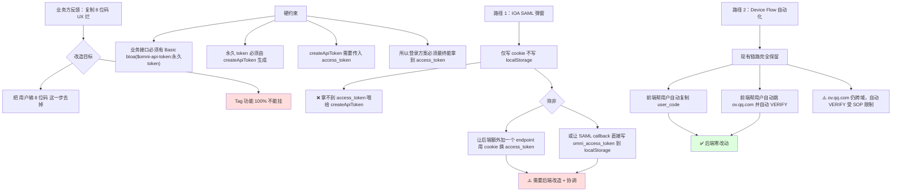
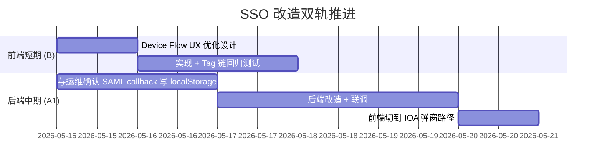

# 差异分析与方案决策

> **写作时间**：2026-05-15
> **依据**：[demo-success-trace.md](./demo-success-trace.md) / [market-failure-trace.md](./market-failure-trace.md) / [relogin-comparison-trace.md](./relogin-comparison-trace.md) 三份录制事实 + 项目代码核对
> **作用**：把三份 trace 的事实拉到同一张表上对比，得出**最小可行改造方案 A**

---

## 0. TL;DR — 5 句话结论

1. **Device Flow 当前完全可用**，业务方让改的真因是"用户要复制 8 位码 + 跨域跳 ov.qq.com" UX 难看
2. demo 站和 market 站的**业务接口认证**统一靠 `Basic btoa("$omni-api-token:" + 永久 API Token)`，**与 cookie 无关**
3. 永久 API Token 由 [`createApiToken()`](../../web/src/nucleus.jsx) 生成，**Tag 功能 100% 依赖** `localStorage.<host>_nucleus_access_token`
4. 之前以为 IOA SAML 弹窗能直接拿 access_token，**实测它只写 cookie 不写 localStorage**——后段 createApiToken 拿不到入参
5. **方案 A**：保留 Device Flow 整条链路 + 把"用户输 8 位码"前端 UI 替换成"自动跳浏览器 + 自动回填" 让 8 位码用户**完全无感**，UX 体验对齐 demo 站；后段 createApiToken → 永久 token → localStorage 一字不动

---

## 1. 事实对比表（三份 trace 拼合）

| 维度                          | demo 站（lightart-dev.woa.com/usdsearch）            | market 站 Device Flow（当前在跑）                  | market 站 IOA SAML（task 4 实测）                  |
| ----------------------------- | ---------------------------------------------------- | -------------------------------------------------- | -------------------------------------------------- |
| 登录入口                      | `/omni/auth/login` 弹窗（同域）                      | 主页弹 8 位 user_code → 用户跳 ov.qq.com           | 直接访问 `/omni/auth/login` 弹窗（同域）           |
| IdP                           | 太湖 SSO `tai.it.tencent.com` + `from=lightmarket`   | Nucleus DeviceFlow + ov.qq.com                     | 太湖 SSO `tai.it.tencent.com`                      |
| **跨域?**                     | ❌ 全程同域                                          | ⚠️ 用户必须跨域跳 ov.qq.com 输码                   | ❌ callback 同域 market.lightart-dev.woa.com       |
| **登录后 localStorage**       | ✅ `omni_access_token` (RS256 JWT, 731 字符)         | ✅ `<host>_nucleus_access_token`（永久 API Token） | ❌ **空**（只有 chakra）                           |
| **登录后 cookie**             | ✅ `nucleus_token`（同域可读）                       | ⚠️ 与登录无关                                      | ✅ `nucleus_token` / `nucleus_refresh` / `nucleus` |
| **业务接口 `/search_hybrid`** | 200 ✅（使用 cookie 自动鉴权）                       | 200 ✅（Basic Auth + 永久 API Token）              | **401 ❌**（既无 Basic Auth，cookie 业务也不认）   |
| **Tag 功能依赖**              | ✅ 已有 `omni_access_token`，可推断有 createApiToken | ✅ `<host>_nucleus_access_token` 已被填入          | ❌ **完全不工作**                                  |
| **UX 痛点**                   | 无                                                   | 🔴 跨域跳 ov.qq.com + 复制 8 位码                  | 无（但功能完全用不了）                             |

---

## 2. 关键代码事实（项目侧）

### 2.1 业务接口认证机制（[`HybridDeepSearchUI.jsx:1336-1337`](../../web/src/HybridDeepSearchUI.jsx)）

```js
} else if (serverAuth.nucleus_api_token && serverAuth.nucleus_api_token.trim() !== "") {
  const basicAuth = btoa("$omni-api-token:" + serverAuth.nucleus_api_token);
  // ...
```

→ market 站业务请求**唯一**鉴权方式：Basic Auth + 永久 API Token，**无 cookie 路径**

### 2.2 Tag 功能依赖链（核心红线）

```
createApiToken (nucleus.jsx:187)
   ↓ 写入
localStorage.<host>_nucleus_access_token
   ↓ 被读取
useBatchTagger.js:151  →  getTaggingToken(host, getHeaders)
useGlobalTags.js:55    →  getTaggingToken(host, getHeaders)
BatchTagModal.jsx:137  →  getTaggingToken(host, getHeaders)
EditableTagsPanel.jsx  →  直接读 localStorage 检查权限
```

### 2.3 当前 SSO 已有但未启用的代码

[`index.js:383`](../../web/src/index.js) 注释表明：之前已经写过"500ms 轮询 `localStorage.omni_access_token` → 调 createApiToken"的逻辑（在 `feature/sso-login-migration` 分支），但**前提是后端会在 SAML callback 时写 `omni_access_token` 到同域 localStorage**——而 market 站后端**不会做这件事**（task 4 已实测）。

### 2.4 ssoBridge 已经被注释掉

[`index.js:77-79`](../../web/src/index.js)：

```js
// === LM CUSTOMIZATION: SSOPostMessage 暂时下线（保留 import 占位） ===
// import { createSSOBridge, buildSSOUrl } from "./utils/ssoBridge";
```

→ 当前没在使用 postMessage 桥接，方向已对，但缺少替代方案。

---

## 3. 根因（最终版）



---

## 4. 方案候选与决策

| 方案   | 描述                                                                                     | 后端改动 | 前端改动 | UX 改善 | Tag 功能风险 | 决策                  |
| ------ | ---------------------------------------------------------------------------------------- | -------- | -------- | ------- | ------------ | --------------------- |
| **A1** | IOA 弹窗 + 后端在 SAML callback 写 `omni_access_token` 到 localStorage（与 demo 站对齐） | 🔴 要    | 中       | 🟢 显著 | 🟢 低        | ⏳ 候选（需运维确认） |
| **A2** | IOA 弹窗 + 后端新增 `/omni/auth/exchange` 接口用 cookie 换 access_token                  | 🔴 要    | 中       | 🟢 显著 | 🟢 低        | ⏳ 候选（需运维确认） |
| **B**  | Device Flow + 前端自动化（隐藏 8 位码、自动开窗、保留跨域）                              | ⚪ 无    | 中       | 🟡 一般 | 🟢 零        | ⏳ 备选               |
| **C**  | 维持现状不动                                                                             | —        | —        | ❌      | —            | ❌ 不可接受           |

> 三方案都不破坏 Tag 链；A1/A2 体验最好但卡运维；B 立即可做但仍需用户切换标签页一次。

---

## 5. 建议路径（双轨推进）

### 5.1 短期（本分支立即可做） — 方案 B

**前端独立完成 Device Flow UX 优化**，零后端依赖：

1. 自动 `window.open('https://ov.qq.com/omni/auth/login/device?code=' + user_code)`，URL 带上 user_code 参数（如果 ov.qq.com 支持）
2. 如果 ov.qq.com 不支持 URL 预填，则**自动复制 user_code 到剪贴板** + Toast 提示"代码已复制，请按 Ctrl+V"
3. 给用户的视觉感知：点一次按钮 → 新标签自动打开 → 粘贴 → 一键 VERIFY → 标签关闭 → 主页自动登录态
4. 后段 `createApiToken → 永久 token → localStorage` 完全不变（**红线**）

### 5.2 中期（待运维 + 后端配合） — 方案 A1

**与运维 / 后端对齐**：market 站后端 `/omni/auth/login/sso/...` 在 SAML callback 成功后，应**对齐 demo 站行为**，把 `omni_access_token` 写到响应页面的 localStorage。如此前端就能：

1. `window.open('/omni/auth/login')` 弹窗
2. 用户秒过 IOA → 弹窗关闭
3. 主页 500ms 轮询 `localStorage.omni_access_token`
4. 拿到后立即 `createApiToken` → 写永久 token → 已登录态

**此方案与 [`index.js:383-385`](../../web/src/index.js) 注释中的预期完全一致**，是这个分支当时设计的目标，只是当时没意识到后端不会写 localStorage。

#### 5.2.1 🔥 实测铁证（A1 卡点的最直接证据）

> **2026-05-21 用户在 market 站手动走完 IOA SAML 流程后的截图坐实**，A1 方案的卡点**就在最后一公里**：

| 现象                         | 数值                                                                                                | 含义                                                                                            |
| ---------------------------- | --------------------------------------------------------------------------------------------------- | ----------------------------------------------------------------------------------------------- |
| Callback 页面文案            | "You have successfully logged in. You can continue to work in your application."                    | ✅ **后端 SAML 验证已通过**（cookie 已 Set-Cookie）                                             |
| 前端 `Gs` 调度器额外发的请求 | `POST /omni/auth/api/sso/saml`（Content-Length 11303，application/json，body = 完整 SAML response） | 🎯 这一步的目的是**用 SAML 换 access_token 写 localStorage**                                    |
| 该请求响应                   | `400 Bad Request`，77 字节 text/plain                                                               | ❌ market 这个端点是 WebSocket-only，HTTP POST 必撞 400                                         |
| `localStorage` 状态          | `omni_access_token` / `omni_refresh_token` / `omni_username` 全空                                   | ❌ 前端轮询拿不到 token → 调不到 [`createApiToken`](../../web/src/nucleus.jsx) → 业务接口全 401 |

**完整 10 条观察点 + 因果链** 见 [`market-failure-trace.md` § 2.1.1](./market-failure-trace.md)。

**核心解读**：A1 卡点**不是** SAML 整体不通，**而是** "把 access_token 写 localStorage" 这一步在 market 站漏了；demo 站之所以能走通，是因为它的 callback HTML 里有这段 JS。**所以方案 A1 落地的最小后端改动 = 3-5 行 JS 注入到 callback HTML**（详见 [`plan-A-spec.md` § 2.2](./plan-A-spec.md)）。

---

## 6. 强制硬约束（写进所有后续设计）

> **Tag 功能 100% 不能挂** = 任何方案的最后一步**必须**：
>
> 1. 调用 [`createApiToken()`](../../web/src/nucleus.jsx) 拿到永久 API Token
> 2. 通过 [`persistSSOLogin()`](../../web/src/utils/authStorage.js) 写入 `localStorage.<host>_nucleus_access_token`
> 3. [BatchTagModal](../../web/src/components/BatchTagModal.jsx) / [useBatchTagger](../../web/src/hooks/useBatchTagger.js) / [useGlobalTags](../../web/src/hooks/useGlobalTags.js) / [EditableTagsPanel](../../web/src/components/EditableTagsPanel.jsx) **一行不动**

---

## 7. 下一步交付（按本目录任务表推进）

- [ ] [`plan-A-spec.md`](./plan-A-spec.md)：双轨方案的实施规格（前端代码改动点 + 后端期望接口）
- [ ] [`risk-rollback.md`](./risk-rollback.md)：风险登记 + Tag 功能验收清单 + 回滚预案

---

## 8. 决策路线图


