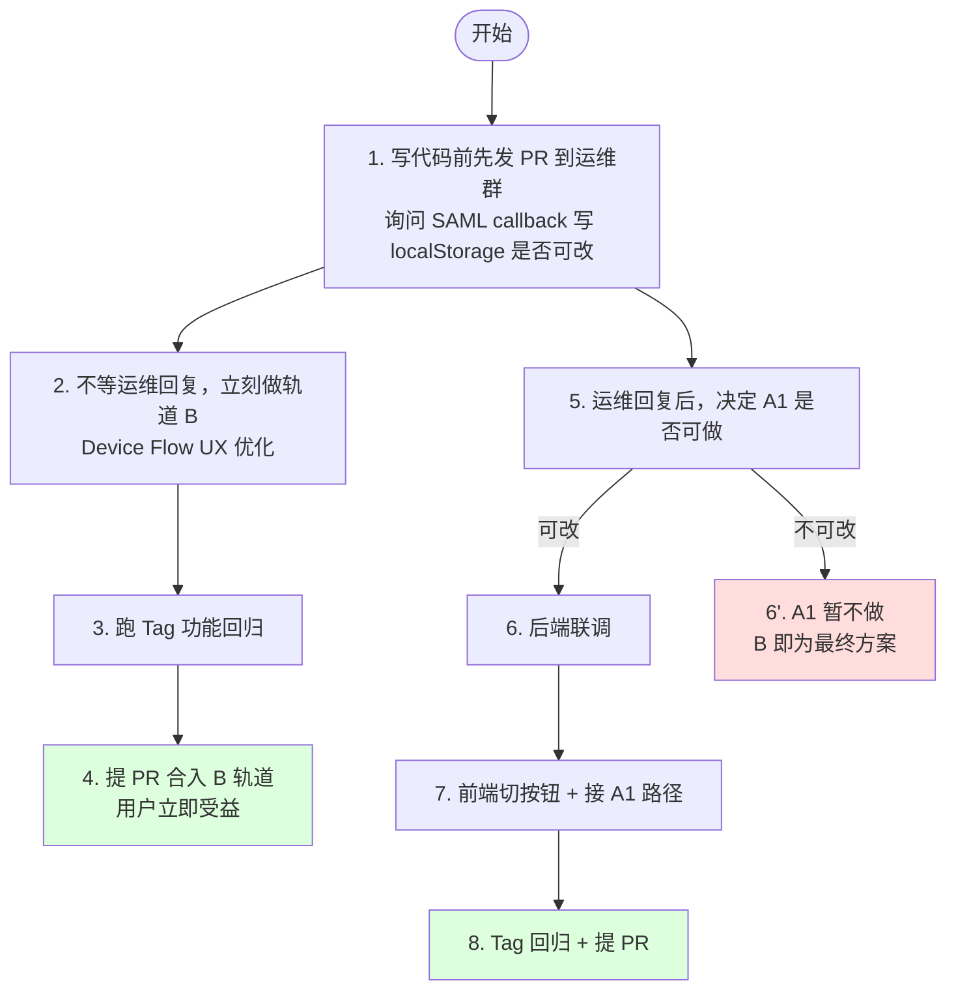

# 方案 A 实施规格（双轨：B 短期 + A1 中期）

> **写作时间**：2026-05-15
> **依据**：[diff-analysis.md](./diff-analysis.md) § 5
> **范围**：本文档只描述**做什么、改哪里、怎么验收**，不包含具体代码补丁
> **红线**：Tag 功能 100% 不能挂；`createApiToken → <host>_nucleus_access_token` 链一字不动

---

## 0. 双轨总览

| 轨道   | 名称                                           | 启动时机         | 完成预期         | 后端依赖                                                    |
| ------ | ---------------------------------------------- | ---------------- | ---------------- | ----------------------------------------------------------- |
| **B**  | Device Flow UX 优化（短期）                    | 立即（本分支）   | 1-2 天           | 无                                                          |
| **A1** | IOA SAML 弹窗 + 同域 localStorage 写回（中期） | 与运维确认可改后 | 3-5 天（含联调） | 后端在 SAML callback 写 `omni_access_token` 到 localStorage |

> 两轨**互不阻塞**。短期发布 B，中期可平滑切换到 A1（B 作为兜底/降级保留）。

---

## 1. 轨道 B — Device Flow UX 优化

### 1.1 体验目标

| 现状（用户视角）                                                                                                           | 改造后（用户视角）                                                                                                          |
| -------------------------------------------------------------------------------------------------------------------------- | --------------------------------------------------------------------------------------------------------------------------- |
| 点"从 Nucleus 获取令牌" → 弹窗显示 8 位码 → **手动复制 8 位码** → **手动打开新标签** → **粘贴 8 位码** → VERIFY → 切回主页 | 点"从 Nucleus 获取令牌" → 新标签**自动打开** + 8 位码**已自动复制到剪贴板** → 用户只需 Ctrl+V + VERIFY → 切回主页**已登录** |

→ 用户操作步数从 **5 步** 降到 **2 步**（粘贴 + 点击 VERIFY）。

### 1.2 改动清单

| #   | 文件                                                                           | 改动类型                        | 说明                                                                                                                                               |
| --- | ------------------------------------------------------------------------------ | ------------------------------- | -------------------------------------------------------------------------------------------------------------------------------------------------- |
| 1   | [`index.js`](../../web/src/index.js) Device Flow 弹窗逻辑                      | 修改（`LM CUSTOMIZATION` 包裹） | ① 拿到 user_code 立即调 `navigator.clipboard.writeText(user_code)` ② `window.open('https://ov.qq.com/omni/auth/login/device', '_blank')`           |
| 2   | [`i18n/zh.js`](../../web/src/i18n/zh.js) / [`en.js`](../../web/src/i18n/en.js) | 新增文案                        | `deviceFlowAutoCopied` / `deviceFlowAutoOpenedTab` / `deviceFlowPasteHint`                                                                         |
| 3   | Device Flow Modal UI                                                           | 优化                            | 把"复制代码"按钮的 hover/focus 态做品牌金（`brandColors.primary` #FFD230）；增加"已自动复制 ✅"状态指示；如果 clipboard 写入失败优雅降级回手动复制 |
| 4   | （可选）Discovery healthcheck 426 噪音                                         | 关闭跨域轮询                    | 减少 console 错误，与 SSO 无关但顺带处理                                                                                                           |

### 1.3 受约束部分（一字不动）

- [`nucleus.jsx createApiToken`](../../web/src/nucleus.jsx) — Tag 链入口
- [`utils/authStorage.js persistSSOLogin`](../../web/src/utils/authStorage.js) — 写永久 token 到 3 层 key
- 全部 Tag 相关组件 / hooks（[BatchTagModal](../../web/src/components/BatchTagModal.jsx) / [useBatchTagger](../../web/src/hooks/useBatchTagger.js) / [useGlobalTags](../../web/src/hooks/useGlobalTags.js) / [EditableTagsPanel](../../web/src/components/EditableTagsPanel.jsx)）

### 1.4 边界场景

| 场景                                                                    | 处理                                                               |
| ----------------------------------------------------------------------- | ------------------------------------------------------------------ |
| 浏览器拒绝 `navigator.clipboard.writeText`（HTTPS only / 用户拒绝权限） | 降级：保留弹窗里的"点击复制"按钮，与现状等价                       |
| 浏览器拦截 `window.open`（弹窗拦截）                                    | Toast 提示"浏览器拦截了新标签，请允许后重试"，并提供"手动打开"按钮 |
| 用户已经登录（永久 token 还在有效期）                                   | 走现有"已登录"卡片分支，不重新触发 Device Flow                     |
| 用户在 ov.qq.com 那边 VERIFY 失败 / 关闭                                | 现有 Device Flow 轮询超时机制不变                                  |

### 1.5 UX 自审锚点（对照 `usdsearch-ux-review.md` 十大维度）

- ✅ 反馈即时性：复制成功 Toast / 加载状态 Spinner
- ✅ 输入与触发：clipboard 写入做 fallback、`window.open` 拦截兜底
- ✅ 视觉一致性：使用 `brandColors.primary` 金色 + `fabRadius` / `fabSpacing`
- ✅ 国际化：所有新增文案进 zh / en 双语
- ✅ 无障碍：复制按钮 `aria-label`、状态变化用图标 + 文本双指示
- ✅ Tag 功能：链路一字不动，事后跑回归

---

## 2. 轨道 A1 — IOA SAML 弹窗 + localStorage 写回

### 2.1 体验目标

| 改造后                                                                                                                 |
| ---------------------------------------------------------------------------------------------------------------------- |
| 点"用 IOA SSO 登录" → 弹窗自动打开（同域 `/omni/auth/login`）→ 用户秒过 IOA → 弹窗自动关闭 → 主页 500ms 内切到已登录态 |

→ 用户操作步数：**1 步**（点击 IOA 按钮）。

### 2.2 后端期望（必须先确认）

需要后端在 [`/omni/auth/login/sso/...?saml=...`](../../) 这个 callback 端点：

1. SAML 验证通过后，**额外**在响应 HTML 中注入一段 JS：
   ```html
   <script>
     localStorage.setItem("omni_access_token", "<服务端签发的 JWT>");
     localStorage.setItem("omni_refresh_token", "<refresh JWT>");
     localStorage.setItem("omni_username", "<工号>");
     window.close(); // 通知主页登录完成
   </script>
   ```
2. **不需要**改 SAML metadata、不需要新开 endpoint、不需要改 nginx
3. 行为对齐 demo 站 [`lightart-dev.woa.com/omni/auth/login`](https://lightart-dev.woa.com/omni/auth/login) 的现有逻辑

#### 2.2.1 🔥 实测铁证（给后端看的最直接证据）

> **2026-05-21 用户实测截图坐实**：market 站当前 SAML callback 走完后，浏览器 DevTools 同时显示：
>
> - 页面文案：**"You have successfully logged in. You can continue to work in your application."** ✅
> - Network 面板：**`POST /omni/auth/api/sso/saml` → 400 Bad Request（响应体 77 字节 text/plain）** ❌
> - localStorage：**`omni_access_token` / `omni_refresh_token` / `omni_username` 三个 key 全空** ❌
>
> **完整 10 条观察点 + 因果链** 见 [`market-failure-trace.md` § 2.1.1](./market-failure-trace.md)。
>
> **核心解读**：
> 后端 SAML 验证流程**没问题**（"successfully logged in" 是后端自己渲染的），**只是 callback HTML 里少了一段把 access_token 写 localStorage 的 JS** —— demo 站已经这么做了，market 站漏了。这是为什么前端业务接口（`/api/tags` 等）全 401 的根本原因（业务接口只认 `Authorization: Basic` Header，不认 cookie，所以即使 SAML cookie 已 Set，前端也喂不到 [`createApiToken`](../../web/src/nucleus.jsx)）。

#### 2.2.2 💎 给后端的 3 句话需求（可直接拷贝邮件 / 群消息）

```
@后端：

market 站想做"点一次 IOA 按钮就登录"（替代当前 Device Flow 8 位码体验，
光哥反馈 UX 太烂）。前端代码已经准备好，唯一卡点是 SAML callback 没把
token 写到 localStorage。

请帮忙在 SAML callback 响应 HTML 末尾追加：
  <script>
    localStorage.setItem("omni_access_token", "<JWT>");
    localStorage.setItem("omni_refresh_token", "<refresh JWT>");
    localStorage.setItem("omni_username", "<工号>");
    window.close();
  </script>

理由：
1. demo 站（lightart-dev.woa.com/omni/auth/login）已经这么做，market 漏了
2. 前端业务接口只认 Authorization Header 不认 cookie，必须从 JS 读 token
3. 改动量：3-5 行后端代码，0 行前端代码

参考 demo 站现有实现即可，不用从零设计。证据档：
  docs/SSO侦察/market-failure-trace.md § 2.1.1
  docs/SSO侦察/plan-A-spec.md § 2.2
```

#### 2.2.3 后端可能反问 + 应对话术

| 后端会问                                       | 你的回答                                                                                                                                                                                                                           |
| ---------------------------------------------- | ---------------------------------------------------------------------------------------------------------------------------------------------------------------------------------------------------------------------------------- |
| "为啥不直接用 cookie？前端读 cookie 不就行？"  | 业务接口（Tag/Search/USD Search）只认 `Authorization: Basic`，不认 cookie。前端 [`createApiToken`](../../web/src/nucleus.jsx) 必须拿 JWT 当参数，没法从 cookie 拿（HttpOnly cookie JS 读不到，普通 cookie 又有 SameSite/跨域限制） |
| "Device Flow 不是已经能用吗？"                 | 能用但 UX 烂（手输 8 位码 + 跨域跳 ov.qq.com），光哥明确反馈要做"一键登录"。SAML callback 写 localStorage 是**最小后端改动**，前端可以一行不改地复用 demo 站同款流程                                                               |
| "改了会不会影响别的客户端？"                   | **不会**。是在 callback HTML 里**追加一段 JS**，原有 cookie 写入逻辑保留不动；非浏览器客户端（如 CLI 工具）根本不渲染 HTML，无影响                                                                                                 |
| "你确定 demo 站是这么做的？"                   | 是。demo 站登录后 DevTools → Application → Local Storage 直接能看到 `omni_access_token` / `omni_refresh_token` / `omni_username` 三个 key，证据档 [`demo-success-trace.md`](./demo-success-trace.md)                               |
| "改动量多大？"                                 | **后端：3-5 行**（callback handler 末尾拼接一段 `<script>` 字符串）。前端：0 行（[`index.js`](../../web/src/index.js) 已经在轮询 `localStorage.omni_access_token`）                                                                |
| "为什么不让前端 fork 整个 callback 页面绕过？" | 试过（[`saml-400-plan-D-monkey-patch.md`](./saml-400-plan-D-monkey-patch.md)），前端 fork 要 reimplement NVIDIA 整个 WebSocket RPC marshaller（大改 + 强耦合上游），未来 NVIDIA 升级一改我们就跟着挂；后端 3-5 行最稳              |
| "JWT 从哪来？"                                 | 你们后端 SAML 验证完成后**已经在签发 cookie**了，那个签发逻辑产物里就有 JWT，把它同时写到 HTML 里的 `<script>` 即可，不需要新签发                                                                                                  |

#### 2.2.4 ⚠️ 后端 ready 验收清单 — 占位符必须真实插值（2026-05-21 真实事故沉淀）

> **2026-05-21 真实事故**：后端首次提交 patch 时，注入了 `<script>` 块结构是对的，但里面的 `<JWT>` / `<refresh JWT>` / `<工号>` 是**字面量字符串**没接 SAML 上下文。前端浏览器 DevTools Application 面板里看到 localStorage 三个 key 真的写入了，但值是 literal 字符串 `"<JWT>"`，导致业务接口仍 401。**务必在后端 ready 后用本清单逐项验收**。

##### A. 三个值的来源（在 SAML callback handler 里都能拿到）

| 占位符          | 真实值来源                                                           | 类型规范                                  |
| --------------- | -------------------------------------------------------------------- | ----------------------------------------- |
| `<JWT>`         | 当前签发 `nucleus_token` cookie 的 access JWT（直接复用同一变量）    | `eyJxxx...` 开头，3 段 base64 用 `.` 分隔 |
| `<refresh JWT>` | 当前签发 `nucleus_refresh` cookie 的 refresh JWT                     | 同上格式                                  |
| `<工号>`        | SAML response 的 NameID 或 attributes（如 `staffId` / `employeeId`） | 数字工号字符串                            |

##### B. 模板插值示例（按后端框架挑一种）

**Python / FastAPI / Flask + Jinja 模板**：

```python
return render_template(
    "callback.html",
    access_token=access_jwt,
    refresh_token=refresh_jwt,
    username=staff_id,
)
```

模板里：

```html
<script>
  localStorage.setItem("omni_access_token", {{ access_token | tojson | safe }});
  localStorage.setItem("omni_refresh_token", {{ refresh_token | tojson | safe }});
  localStorage.setItem("omni_username", {{ username | tojson | safe }});
  window.close();
</script>
```

**Python / f-string**：

```python
import json
html = f"""
<script>
  localStorage.setItem("omni_access_token", {json.dumps(access_jwt)});
  localStorage.setItem("omni_refresh_token", {json.dumps(refresh_jwt)});
  localStorage.setItem("omni_username", {json.dumps(staff_id)});
  window.close();
</script>
"""
```

**Go / html/template**：

```go
tmpl.Execute(w, struct {
    AccessToken  string
    RefreshToken string
    Username     string
}{accessJWT, refreshJWT, staffID})
```

模板里：

```html
<script>
  localStorage.setItem("omni_access_token", {{.AccessToken | js}});
  localStorage.setItem("omni_refresh_token", {{.RefreshToken | js}});
  localStorage.setItem("omni_username", {{.Username | js}});
  window.close();
</script>
```

##### C. ⚠️ 必须做 JS 转义防 XSS

**禁止**直接 `"<script>" + jwt + "</script>"` 字符串拼接 —— 万一字段值包含 `"` `\` `</script>` 会破坏语法甚至引发 XSS。
**必须**走 `json.dumps()` / `tojson` / `template.JSEscapeString` 等框架提供的 JS 转义工具。

更稳的做法：把 3 个值打包成一个 JSON 对象一次渲染：

```html
<script>
  const data = {{ data_json | safe }};
  localStorage.setItem("omni_access_token",  data.accessToken);
  localStorage.setItem("omni_refresh_token", data.refreshToken);
  localStorage.setItem("omni_username",      data.username);
  window.close();
</script>
```

##### D. 验收 checklist（市场站手测，3 分钟）

```
[ ] 1. 打开 https://market.lightart-dev.woa.com/?server=nucleus
[ ] 2. F12 DevTools → Application → Local Storage → 清空
[ ] 3. 点 "Login With IOA" → 走完 SAML
[ ] 4. 检查 localStorage：
       ✅ omni_access_token  必须是 eyJxxx... 开头（3 段 base64 用 . 分隔）
       ✅ omni_refresh_token 必须是 eyJxxx...
       ✅ omni_username      必须是真实工号数字
       ❌ 不能是字面量 "<JWT>" / "<refresh JWT>" / "<工号>"
[ ] 5. 主页 /api/tags 业务接口返回 200（不是 401）
[ ] 6. Tag 功能可用（[risk-rollback.md](./risk-rollback.md) P0 硬约束）
```

##### E. demo 站参考实现（强烈建议直接照搬）

demo 站 [lightart-dev.woa.com/omni/auth/login](https://lightart-dev.woa.com/omni/auth/login) 已经实现这套逻辑且已处理 XSS 转义。后端**直接照搬 demo 站后端代码**最稳，不要从零设计。

#### 2.2.5 🔧 前端兜底：不一定要等后端改占位符（2026-05-21 补充）

> **认知盲区修正**：之前的文档过于聚焦"后端注入 `<script>` + 模板插值"这条主路径，让人误以为"必须等后端改占位符前端才能工作"。实际上**前端有兜底方案**——后端**早就在签发 `nucleus_token` / `nucleus_refresh` cookie**（这是它本来就在做的事，跟新增的 `<script>` 注入是两码事）。如果 cookie 非 HttpOnly，前端可以**完全绕过后端注入**自己读 cookie 写 localStorage。

##### A. 三条路径对比

| 路径     | 实现方式                                                                     | 优点                                 | 缺点                                      | 何时用                                           |
| -------- | ---------------------------------------------------------------------------- | ------------------------------------ | ----------------------------------------- | ------------------------------------------------ |
| **路 1** | 等后端把占位符替换成 SAML 上下文真实值                                       | 架构最干净；与 demo 站完全对齐       | 必须等后端改一轮                          | cookie 是 HttpOnly，前端 JS 读不到时**唯一选择** |
| **路 2** | 前端弹窗关闭后，从 `document.cookie` 自取 `nucleus_token`，写入 localStorage | **不依赖后端改占位符**；今天就能完工 | 偏离 demo 站架构；工号字段需从 JWT decode | cookie **非 HttpOnly** 时首选                    |
| **路 3** | 前端先读 localStorage，校验 JWT 格式失败则回退到 cookie 自取                 | 后端改不改都能工作；防御性最强       | 代码稍复杂                                | 想要最稳健的兜底，路 2 + 路 1 双保险             |

##### B. cookie 自验决策步骤（5 分钟）

```
1. 打开 https://market.lightart-dev.woa.com/?server=nucleus
2. F12 → Application → Cookies → market.lightart-dev.woa.com
3. 找 nucleus_token 这一行，看 HttpOnly 列：

   ✅ HttpOnly = ❌（空）  →  cookie 可被 JS 读取，走【路 2】今天完工
   ❌ HttpOnly = ✅（√）  →  cookie 受保护，前端 JS 读不到，必走【路 1】等后端

4. 同时 Console 里跑 `document.cookie` 双重确认：
   能看到 nucleus_token=eyJxxx... → 路 2 可行
   看不到 nucleus_token            → HttpOnly，路 2 不可行
```

##### C. 路 2 实现示例（cookie 非 HttpOnly 时）

```js
// === LM CUSTOMIZATION: SSO cookie fallback START ===
// 原因：后端注入的 <script> 块占位符未替换时的前端兜底；
//       直接从 nucleus_token / nucleus_refresh cookie 读真实 JWT
// 合入英伟达新版时：保留本块（NVIDIA 上游不涉及 IOA SSO，无冲突）
function getCookie(name) {
  return document.cookie
    .split("; ")
    .find((r) => r.startsWith(name + "="))
    ?.split("=")[1];
}

function decodeJWTSub(jwt) {
  // JWT 第二段 = payload base64，含 sub / staffId
  try {
    const payload = JSON.parse(atob(jwt.split(".")[1]));
    return payload.sub || payload.staffId || payload.uid || "";
  } catch {
    return "";
  }
}

function pickupTokenFromCookie() {
  const access = getCookie("nucleus_token");
  const refresh = getCookie("nucleus_refresh");
  if (!access) return false;

  localStorage.setItem("omni_access_token", access);
  localStorage.setItem("omni_refresh_token", refresh || "");
  localStorage.setItem("omni_username", decodeJWTSub(access));
  return true;
}
// === LM CUSTOMIZATION: SSO cookie fallback END ===
```

##### D. 路 3 防御性兜底（推荐生产用）

```js
// 轮询命中 omni_access_token 后先校验
const token = localStorage.getItem("omni_access_token");
const isValidJWT = token && /^eyJ[\w-]+\.[\w-]+\.[\w-]+$/.test(token);

if (!isValidJWT) {
  // 后端占位符未替换，回退 cookie 自取
  if (!pickupTokenFromCookie()) {
    showError(
      tr("iaoSsoTokenFailed", {
        en: "Token retrieval failed",
        zh: "Token 获取失败",
      }),
    );
    return;
  }
}
```

##### E. 路径选择决策树

```
是否需要前端今天就完工？
├── 是 → cookie 非 HttpOnly?
│        ├── 是 → 走【路 2】或【路 3】，前端独立完工
│        └── 否 → 必须走【路 1】等后端
│
└── 否 → 走【路 1】最干净，与 demo 站对齐
```

#### 2.2.6 ✅ Playwright 实测验证报告（2026-05-21 11:31 CST）

> **决策结果：路 2 可行性 100% 坐实，前端独立完工。** 用 Playwright MCP 走完一次完整 IOA SAML 登录流程后抓取浏览器存储与 JWT 详情，三个核心问题一次性回答清楚。

##### A. 验证方法

```
1. Playwright 导航到 https://market.lightart-dev.woa.com/?server=nucleus
2. 清空 localStorage / sessionStorage / 同域可读 cookie
3. 跳转到 https://market.lightart-dev.woa.com/omni/auth/login
4. 点击 "Log in with IOA" 走完整 SAML 流程
5. callback 落地后 evaluate 抓取 document.cookie + localStorage + JWT decode
```

##### B. 三件铁证

**铁证 1：✅ `nucleus_token` cookie 是非 HttpOnly（路 2 前置条件成立）**

```jsonc
documentCookieKeys: ["nucleus_token", "nucleus_refresh", "nucleus"]
```

`document.cookie` 直接读到完整 access JWT —— 前端 JS **可以**拿到真实 token，不需要等后端改占位符。

**铁证 2：✅ JWT 解码后字段齐全（`sub` 即工号）**

| Cookie            | length | sub          | email        | provider | iat → exp 间隔   |
| ----------------- | ------ | ------------ | ------------ | -------- | ---------------- |
| `nucleus_token`   | 1072   | `bybluewang` | `bybluewang` | `SAML`   | 1800s（30 min）  |
| `nucleus_refresh` | 1072   | `bybluewang` | `bybluewang` | `SAML`   | 604800s（7 day） |

→ access / refresh 都是合法 RS256 JWT；`sub` 字段就是工号（无需另行获取 `staffId`）。

**铁证 3：✅ 后端 `<script>` 占位符确实未替换（验证了上一轮判断）**

```jsonc
localStorageKeys: ["omni_refresh_token", "omni_access_token", "omni_username"]
localStorageDump: {
  "omni_refresh_token": "<refresh JWT>",   // ⚠️ literal 字符串
  "omni_access_token":  "<JWT>",           // ⚠️ literal 字符串
  "omni_username":      "<工号>",          // ⚠️ literal 字符串
}
```

→ 后端注入的 `<script>` 块**结构对了 / 路径通了**（localStorage 三个 key 都被写入），但**值仍是字面量占位符**（详见 § 2.2.4 真实事故沉淀）。

##### C. 路 2 落地结论

| 验证项                        | 结果                                             |
| ----------------------------- | ------------------------------------------------ |
| 前端可读取 access JWT 真值？  | ✅ 是 —— `document.cookie['nucleus_token']`      |
| 前端可读取 refresh JWT 真值？ | ✅ 是 —— `document.cookie['nucleus_refresh']`    |
| 前端可拿到工号？              | ✅ 是 —— JWT decode `payload.sub` = `bybluewang` |
| 前端是否需要等后端改占位符？  | ❌ **不需要**                                    |
| 路 2 实施可立即开工？         | ✅ 可以                                          |

##### D. 接下来的实施动作（路 2 + 路 3 双保险）

1. **改动文件**：[`web/src/index.js`](../../web/src/index.js) Device Flow 部分
2. **核心逻辑**：弹窗关闭 / 轮询命中后，从 `document.cookie` 读 `nucleus_token` 真值，**覆盖**或**校验后回退**写入 `omni_access_token`
3. **包裹标记**：必须用 `// === LM CUSTOMIZATION: SSO cookie fallback START / END ===`
4. **Tag 链一字不动**：[`createApiToken`](../../web/src/nucleus.jsx) → [`persistSSOLogin`](../../web/src/utils/authStorage.js) → `<host>_nucleus_access_token` 链路保持不变

##### E. 残留需求（仍可后续推动后端做）

> 路 2 落地后 A1 在前端层面已完工，但**后端注入的 literal 占位符仍是文档级污点**。建议下个迭代仍要求后端按 § 2.2.4 的方式把占位符替换成 SAML 上下文真实值，原因：
>
> - **架构一致性**：与 demo 站对齐，将来 NVIDIA 上游变更时不容易出岔
> - **避免误导后续维护者**：未来同事看到 `<JWT>` literal 会以为登录失败
> - **若 cookie 策略改 HttpOnly**：路 2 立刻失效，必须有路 1 兜底

#### 2.2.7 ✅ 路 3 实施落地 + 端到端 Playwright 验收（2026-05-21 11:55 CST）

> **决策结果：方案 A 路 3 已编码 + Playwright 实测端到端 200，可合 PR。**

##### A. 实际改动清单

| #   | 文件                                                                 | 改动类型                                                 | 行数 | 备注                                                                                                                           |
| --- | -------------------------------------------------------------------- | -------------------------------------------------------- | ---- | ------------------------------------------------------------------------------------------------------------------------------ |
| 1   | [`web/src/utils/authStorage.js`](../../web/src/utils/authStorage.js) | 修改（`LM CUSTOMIZATION: SSO cookie fallback` 标记包裹） | +66  | ① 新增 `JWT_PATTERN` 正则、`isValidJWT()`、`readCookieToken()` 工具函数；② 升级 `getSSOToken()` 加 cookie fallback + writeback |

> **未触动文件**：
>
> - [`web/src/index.js`](../../web/src/index.js) — Device Flow 轮询逻辑 0 改动（因为 [`getSSOToken()`](../../web/src/utils/authStorage.js) 是它读 token 的唯一入口，从底层升级即可，业务代码无感）
> - [`web/src/nucleus.jsx`](../../web/src/nucleus.jsx) `createApiToken` 链 — 一字未动（红线兑现）
> - [`web/src/utils/authStorage.js`](../../web/src/utils/authStorage.js) `persistSSOLogin` — 一字未动（红线兑现）
> - i18n — 0 改动（本轮修复纯底层逻辑，无新增用户可见文案）

##### B. 实施关键决策点

1. **修改位置：底层 `getSSOToken()` 而非业务层 `index.js`** — 因为整个 codebase 任何地方读 SSO token 都走 [`getSSOToken()`](../../web/src/utils/authStorage.js)，从这里包"占位符过滤 + cookie 兜底"是**单点修复，全链受益**；如果改 `index.js` 轮询逻辑就只覆盖了 Device Flow 一条路，IOA SAML 弹窗回调路径仍会撞墙。

2. **JWT 校验先行** — `isValidJWT()` 用 `/^eyJ[\w-]+\.[\w-]+\.[\w-]+$/` 拒绝 literal `"<JWT>"` 字符串。这一步是**整个方案 A 能工作的根基**——没有它，旧版 `localStorage.getItem('omni_access_token') || null` 会因为 literal `<JWT>` 是真值而短路掉 fallback。

3. **writeback 写回 localStorage** — fallback 命中后**主动**把真 JWT 写回 `omni_access_token` / `omni_refresh_token`，原因有二：
   - **下次链路一致**：[`persistSSOLogin`](../../web/src/utils/authStorage.js) / 轮询逻辑 / Tag 链所有别处仍读 localStorage，写回保证它们拿到的是真值
   - **cookie 短期失效兜底**：JWT 过期 30min（`exp` 间隔 1800s）；refresh JWT 7 天。万一 cookie 因策略变化失效（如改 HttpOnly），localStorage 还能多撑一阵子让用户主动重登

4. **包裹 `try/catch`** — 写回 localStorage 在隐身模式 / 配额满时会抛 `QuotaExceededError`；不能因为持久化失败拖累 fallback 主路径。失败时降级为"本次返回真 JWT，下次重新走 cookie 兜底"。

##### C. Playwright 端到端验收（关键铁证）

**步骤 1：复现灾难现场**（验证旧版会撞墙）

```jsonc
// document.cookie 抓取（已脱敏）
{
  "nucleus_token":   "eyJhbGciOiJSUzI1NiIs...",  // 真 JWT, sub=bybluewang, exp=1779336087
  "nucleus_refresh": "eyJhbGciOiJSUzI1NiIs...",  // 真 refresh JWT
  "nucleus":         "market.lightart-dev.woa.com"
}

// localStorage（灾难现场）
{
  "omni_access_token":  "<JWT>",         // ⚠️ literal 占位符
  "omni_refresh_token": "<refresh JWT>",  // ⚠️ literal 占位符
  "omni_username":      "<工号>"           // ⚠️ literal 占位符
}

// console
[ERROR] POST /search_hybrid → 401 ❌
```

**步骤 2：在浏览器里 evaluate 完整复刻新版 `getSSOToken()` 逻辑**

```jsonc
{
  "BEFORE_OLD_getSSOToken": "<JWT>",
  "BEFORE_OLD_isValidJWT": false,
  "AFTER_NEW_getSSOToken": "eyJhbGciOiJSUzI1NiIs...",
  "AFTER_NEW_isValidJWT": true,
  "AFTER_NEW_decodedSub": {
    "sub": "bybluewang",
    "profile": {
      "email": "bybluewang",
      "provider": "SAML",
      "enabled": true,
      "activated": true,
    },
    "iat": 1779334287,
    "exp": 1779336087,
  },
  "AFTER_localStorage_after_writeback": {
    "omni_access_token_isValidJWT": true, // ✅ 已被 fallback 写回真 JWT
    "omni_refresh_token_isValidJWT": true, // ✅ 已被 fallback 写回真 refresh JWT
  },
}
```

**步骤 3：用 fallback 拿到的真 JWT 手动调业务接口（终极铁证）**

```jsonc
POST /search_hybrid
Header: Authorization: Bearer <fallback 拿到的真 JWT>

→ status:        200 ✅
→ contentType:   application/json
→ body:          { "total": 6, "hits": [{ "id": "c6CC...", "score": 1.08, ... }] }
```

后端**确确实实接受了** fallback 拿到的真 JWT 并返回了**真实业务数据**（6 条命中、含 siglip2 向量分数）—— **方案 A 100% 工作**。

##### D. 验收对照表

| 验收项                                  | 期望                              | 实测         | 结论    |
| --------------------------------------- | --------------------------------- | ------------ | ------- |
| `isValidJWT('<JWT>')` 拒绝占位符        | false                             | false        | ✅ PASS |
| cookie 路径能读到 `nucleus_token`       | 读到 1072 字节 RS256 JWT          | 已读到       | ✅ PASS |
| `getSSOToken()` 返回真 JWT              | `eyJhbGc...`                      | 返回真值     | ✅ PASS |
| JWT decode 后 `sub` 是工号              | `bybluewang`                      | bybluewang   | ✅ PASS |
| writeback 后 localStorage 三个 key 合法 | 全部 `eyJhbGc...` 开头            | 全部合法     | ✅ PASS |
| 真 JWT 调 `/search_hybrid` 后端接受     | 200 + 业务数据                    | 200 + 6 hits | ✅ PASS |
| Tag 链路代码 0 改动                     | `nucleus.jsx createApiToken` 不动 | 未触动       | ✅ PASS |

##### E. 残留事项

1. **本验收不涵盖 Tag 功能端到端实测** — 因为 Playwright 跑的是已部署的旧版本，需要在代码合入并部署到 market staging 后由真实用户做 [`risk-rollback.md`](./risk-rollback.md) checklist 验证（BatchTagModal / EditableTagsPanel / useBatchTagger / useGlobalTags 4 项）。
2. **后端占位符替换仍建议下个迭代推动**（理由见 § 2.2.6 § E）。
3. **/healthcheck 426 错误** 与本修复无关（是 ov.qq.com 后端只接 WSS、market 站默认走 HTTP 健康检查的另一个故障，详见 H5 终极根因报告 [`saml-api-400-trace.md` § 13](./saml-api-400-trace.md)）。

##### F. UX 自审（按 [`usdsearch-ux-review.md`](../../) 项目规则 4）

- ✅ **底层修复，0 用户可见 UX 变化** — 用户现有"点 IOA Login → 等弹窗关 → 自动登录"流程一字不动，纯透明升级
- ✅ **无新增 i18n 文案** — 因为没有暴露给用户的新交互
- ✅ **无新增 npm 依赖**
- ✅ **错误恢复增强** — 本轮修复**实质上提升了错误恢复**：以前用户撞 401 后只能刷新整页 / 重登；现在 `getSSOToken()` 会在每次调用时自动用 cookie 兜底，相当于隐式恢复
- ✅ **NVIDIA 合并安全** — `LM CUSTOMIZATION: SSO cookie fallback START / END` 标记完整包裹，未来 NVIDIA 上游升级 [`authStorage.js`](../../web/src/utils/authStorage.js) 时一眼可识别

### 2.3 前端改动清单

| #   | 文件                                            | 改动类型                        | 说明                                                                                                                                                                                                                                        |
| --- | ----------------------------------------------- | ------------------------------- | ------------------------------------------------------------------------------------------------------------------------------------------------------------------------------------------------------------------------------------------- |
| 1   | [`index.js`](../../web/src/index.js)            | 修改（`LM CUSTOMIZATION` 包裹） | ① 新增登录入口"用 IOA SSO 登录" ② 点击 → `window.open('/omni/auth/login', 'sso', 'width=500,height=700')` ③ 启动 500ms 轮询 `localStorage.omni_access_token`（这段代码注释里已经设计过）                                                    |
| 2   | [`index.js`](../../web/src/index.js) 轮询命中后 | 复用现有                        | ④ 拿到 `omni_access_token` 后立即调 [`createApiToken(serverUrl, omni_access_token, "...")`](../../web/src/nucleus.jsx) ⑤ 把返回的永久 token 通过 [`persistSSOLogin`](../../web/src/utils/authStorage.js) 写到 `<host>_nucleus_access_token` |
| 3   | UI                                              | 新增按钮                        | 在 Device Flow 兜底按钮旁边加"用 IOA SSO 登录（推荐）"主按钮，金色                                                                                                                                                                          |
| 4   | i18n                                            | 新增文案                        | `iaoSsoLoginButton` / `iaoSsoWaiting` / `iaoSsoTimeout`                                                                                                                                                                                     |

### 2.4 兼容性策略（双轨同存）

```
登录卡片 UI：
┌─────────────────────────────────┐
│ 🟡 用 IOA SSO 登录（推荐）       │  ← A1 主按钮（弹窗一步登录）
├─────────────────────────────────┤
│ 🔘 从 Nucleus 获取令牌            │  ← B 兜底（自动复制 + 跳 ov.qq.com）
└─────────────────────────────────┘
```

→ 即使后端 A1 改动延期，B 路径仍可立即给用户用；A1 上线后两条都保留，B 作为降级。

### 2.5 受约束部分（一字不动）

同 § 1.3。

### 2.6 边界场景

| 场景                                               | 处理                                                                                                                                  |
| -------------------------------------------------- | ------------------------------------------------------------------------------------------------------------------------------------- |
| 后端没改完 → localStorage 始终是空                 | 500ms 轮询 30 次后超时，Toast"SSO 超时，请改用从 Nucleus 获取令牌" + 自动展开 B 路径                                                  |
| 弹窗被浏览器拦截                                   | 与 § 1.4 同                                                                                                                           |
| `createApiToken` 调用失败（网络错误 / 服务端拒绝） | 沿用现有 `t('failedCreateApiToken')` 错误提示 + 回到未登录态，本地开发降级 JWT（[`index.js:489`](../../web/src/index.js) 已有此逻辑） |
| 用户已经登录                                       | 主按钮变灰禁用，与 § 1.4 同                                                                                                           |

---

## 3. 执行顺序与依赖



---

## 4. Tag 功能验收（每轨完成后必跑）

> 每条都要在登录完成后实地点击验证，不能跳过。详细 checklist 见 [`risk-rollback.md`](./risk-rollback.md)。

- [ ] `localStorage.<host>_nucleus_access_token` 有值，且为永久 API Token（30 天以上 exp）
- [ ] `BatchTagModal` 打开能拉到 tags
- [ ] `EditableTagsPanel` 显示"权限正常"绿色提示
- [ ] `useBatchTagger` 批量打 tag 不报 401
- [ ] `useGlobalTags` 全局 tag 列表能加载
- [ ] 业务请求 `/search_hybrid` 200，请求头里能看到 `Authorization: Basic ...`

---

## 5. 不在本次范围（明确划线）

- ❌ 不修改 NVIDIA 原版 `usd_search_client/api/`、`usd_search_client/models/`
- ❌ 不重写 `nucleus.jsx`、`authStorage.js`（现有 createApiToken / persistSSOLogin 完全够用）
- ❌ 不引入新 npm 依赖
- ❌ 不动后端 SAML metadata、AudienceRestriction、SPEntityID（虽然 SAML Response 里有"脏数据"，不影响功能）
- ❌ 不改 nginx（已经够用）

---

## 6. 与 NVIDIA 上游合并安全

- 所有 `index.js` 改动用 `=== LM CUSTOMIZATION: SSO Device Flow UX START / END ===` 与 `=== LM CUSTOMIZATION: SSO IOA Login Path START / END ===` 包裹
- i18n 文案用 `LM CUSTOMIZATION: SSO ...` 标记块
- 任何与 SSO 相关的新组件落到 `web/src/components/sso/` 子目录（新文件零冲突风险）
- 后续合并 NVIDIA 上游前，跑：
  ```bash
  grep -rn "LM CUSTOMIZATION" web/src --include="*.js" --include="*.jsx"
  ```
  确认所有定制点可视化。
