# 用户身份过期后 Tag 写操作翻车 —— 根因报告与分级修复方案

> 分支：`lm`  
> 日期：2026-05-21  
> 输入：杨晗光 PM 反馈 + 顾其瑞（calvin）演示翻车现场 console 日志 + 王博扬转述  
> 状态：**只读调研产物**，不修改任何业务代码；待用户基于本文档选定档位后再开 implementation plan。

---

## TL;DR

1. **根因不是单一的 wss token 过期**，而是「HTTP API Token / SSO JWT / wss access_token / refresh_token」**四类凭据时效不一致**叠加「Tag 写操作走 wss，而 `useAuthGuard` 全局拦截器仅覆盖 fetch」造成的盲区。
2. **F5 能拿到资产列表**是因为 `useAuthGuard` 首次校验若已过 30s 阈值会重新发 `/info/plugins`，过期时清掉旧凭据并触发 Device Flow Modal 自动登录；登录成功后 HTTP 资产链路立刻恢复 —— **但这条恢复链不通知 `taggingService` 的 25 分钟内存缓存**。
3. **增删 tag 报 token 过期**实际是「`getTaggingTokenWithMeta` 的 fallback 链最后落到 headers 里的 API Token 上，被 wss 服务器 1008 拒绝」的结构化结果（也可能是 1006 被启发式归为 auth）。`useAuthGuard` 401 拦截器虽然在 fetch 拦截了，但 **`new WebSocket()` 不走 fetch**，所以 tag 报错没有触发 Modal 重登录引导。
4. **Console 看到的 4 类报错**里：
   - `discovery/healthcheck 426` × N 次 是 **SDK 正常协议升级噪音**，不是 bug
   - `/search_hybrid 401` 和 `useNucleusTree HTTP 401` 才是真故障入口
   - 5 次 `[TaggingService] dialing` 没有后续 close 日志，说明 wss 握手很可能直接 401（浏览器对 wss 握手失败统一吐 1006）
5. 推荐修复组合：**T0（必修，标日志/收文案）+ T1（必修，让 wss auth 错也走 `auth-guard-open`）**，T2 主动保活作为加分项可选。

---

## 1. 现象与证据

### 1.1 现场 Console 日志映射（用户提供，逐字保留）

| 行号 | 日志内容 | 来源代码 | 性质 |
|---|---|---|---|
| L1 | `Failed to load resource: status 426 (Upgrade Required)` | @omniverse SDK 内部 | **噪音**：SDK 用 HTTP GET 探测 wss 端点的协议升级握手响应 |
| L2 | `index.js:249 Found the (wss:) path-based deployment via HTTP for https://ov.qq.com/omni/discovery/healthcheck` | @omniverse SDK 注入的 console 输出 | **噪音**：SDK 成功识别到 wss 协议的正常日志 |
| L3 | `index.js:1468 Persistent image cache initialized` | `web/src/index.js` 缩略图缓存 | 信息 |
| L4 | `taggingService.js:236 [TaggingService] dialing Object` × 5 次 | `web/src/services/taggingService.js:236`（`new WebSocket` 之前的拨号日志） | 信息（但 **5 次连发等于用户点了 5 次 tag**） |
| L5 | `ov.qq.com/omni/discovery/healthcheck:1  status 426` × N | 同 L1 | **噪音** |
| L6 | `/search_hybrid:1  status 401` | `HybridDeepSearchUI.jsx:2264-2284` 或 `nucleusListingService.js:136` 发出的搜索/目录树请求 | **真故障**：HTTP 侧 API Token / SSO Bearer 已被服务端拒 |
| L7 | `installHook.js:1 [useNucleusTree] root listing failed: listing fetch failed: HTTP 401` | `hooks/useNucleusTree.js:158` `console.warn` | **真故障**：目录树拉取被拒，仅打印不弹窗 |
| **缺失** | 没有后续 wss `close` 事件、没有 `TaggingError` JSON 打印 | —— | **关键缺口**：calvin 没截到 wss 失败的结构化日志，但根据代码路径必然产生 |

### 1.2 关键代码位置（凭证 / 通信 / 拦截）

```
web/src/
├── services/
│   ├── taggingService.js              # wss 唯一创建点（L251），token 25min 缓存（L740），三级 localStorage 查找（L666-694），refresh fallback（L721-763）
│   └── nucleusListingService.js       # 目录树 HTTP listing，headers 不含 SSO Bearer（L102-115），仅 Basic / x-api-key（与主搜索 headers 不对齐）
├── hooks/
│   ├── useAuthGuard.js                # ★ 已有的"身份过期"中枢：fetch 拦截 401/403（L216-228），主动校验 /info/plugins（L79-101），visibilitychange 重校验（L253-266）
│   ├── useTagManager.js               # tag 增删入口；syncToServer preflight 取 token（L444-489）；失败标 'failed' 状态
│   └── useNucleusTree.js              # 目录树状态机，listing 401 仅 console.warn（L158）+ status='error'，无 UI 弹窗
├── utils/
│   └── authStorage.js                 # 凭据 localStorage 抽象：clearExpiredCredentials（L107，仅清值不写 cleared）/ clearAuthByUserAction（L120，清值+写 cleared）/ persistSSOLogin（L226，25min expiry 硬编码 L235）
├── components/
│   └── EditableTagsPanel.jsx          # 红色 failed chip + 错误诊断卡（已能展示 TaggingError，但只在 panel 内）
├── nucleus.jsx                        # SDK 适配层；refreshAccessToken 在此（taggingService 动态 import 调用）
├── HybridDeepSearchUI.jsx             # ★ 主组件，在 L925 挂载 useAuthGuard；L2264-2284 处理 /search_hybrid 401 仅 toast warning
└── index.js                           # DeviceFlow 入口；监听 auth-guard-open；HeaderIcons 锁图标徽标
```

---

## 2. 根因链路

### 2.1 四类凭据的时效与作用域

| 凭据 | 来源 | 用途 | TTL | 失效后是否能自救 |
|---|---|---|---|---|
| **A. API Token** (`$omni-api-token` Basic Auth) | Device Flow `createApiToken` 永久颁发，或 SSO 流程下用 JWT 换 | HTTP `/search_hybrid` / `/info/plugins` / nucleus listing | **永久**（除非用户清除） | 永久有效，不该出现 401 |
| **B. SSO JWT Bearer** (`omni_access_token`) | SAML/SSO 回调写入 cookie + localStorage | HTTP Authorization Bearer（仅 `HybridDeepSearchUI.getHeaders()` 与 `useAuthGuard.buildAuthHeaders` 用） | 由 SAML IdP 控制（数小时） | 失效→自动 fallback Basic，应感知不到 |
| **C. wss access_token** (`nucleus_access_token`) | DeviceFlow 颁发 / SSO 时也复用 JWT | wss `/omni/tagging3?access_token=...` 鉴权 | **25 分钟**硬编码（`authStorage.js:235` + `taggingService.js:740`） | refresh_token 可用→自动 refresh；否则需重登录 |
| **D. refresh_token** (`nucleus_refresh_token`) | DeviceFlow 颁发 | 刷新 C | Nucleus 后端控制（数小时～数天） | 失效→必须重新走 Device Flow |

### 2.2 长时间挂机时间线

```mermaid
gantt
    title 长挂机后各凭据失效时序（假设 t=0 为登录时刻）
    dateFormat  X
    axisFormat %s 分钟

    section 凭据 TTL
    A. API Token (永久)        :active, a, 0, 480
    B. SSO JWT (~120 min)       :crit,   b, 0, 120
    C. wss access_token (25min) :crit,   c, 0, 25
    D. refresh_token (~240 min) :        d, 0, 240

    section 用户操作可用性
    F5 拉资产列表 (用 A/B)      :         u1, 0, 480
    增删 tag (用 C，自动 refresh):        u2, 0, 240
    增删 tag (refresh 失败)     :crit,    u3, 240, 480
```



**关键结论**：
- **0-25 min**：一切正常
- **25-120 min**：wss 缓存过期，但 refresh_token 救活；SSO Bearer 还在；用户无感知
- **120-240 min**：SSO Bearer 过期，HTTP 自动降到 Basic（A），仍正常；wss 持续 refresh 救活
- **240+ min**（calvin 演示场景）：D 也过期 → `taggingService.refreshAccessToken` 抛错 → `getTaggingTokenWithMeta` fallback 到 headers token → wss 拿着 **API Token 当作 access_token** 去 connect → **服务端 1008 拒绝**（API Token 不是 JWT，不带 exp claim，wss 鉴权器不认）
- 与此同时，**HTTP 用 A 仍正常工作**（这就是"F5 能拉资产但不能改 tag"的物理解释）
- **但日志里的 `/search_hybrid 401`** 说明 calvin 的场景里 A 也被服务端拒了 —— 怀疑是某次 `clearExpiredCredentials` 误清了 A 后还没等到 Device Flow Modal 完成就又点了 tag，或者后端调整了 API Token 的过期策略

### 2.3 为什么 `useAuthGuard` 没能救场？

`useAuthGuard.js:216-228` 的全局 fetch 拦截器：

```js
window.fetch = async (...args) => {
  const response = await originalFetch(...args);
  if (response.status === 401 || response.status === 403) {
    if (hasStoredCredsUtil(selectedBackend) && !isUserCleared(selectedBackend)) {
      clearExpiredCredentials(selectedBackend);
    }
    hasShownRef.current = false;
    triggerAuthOpen('http-401');
  }
  return response;
};
```

**两个盲区**：
1. **`new WebSocket()` 不走 `window.fetch`**，浏览器 WebSocket API 是另一条独立通道。wss 鉴权失败时 fetch 拦截器完全感知不到。
2. **`triggerAuthOpen` 是幂等的**（`hasShownRef.current` 防重入），但 `clearExpiredCredentials` 在 401 时立刻清掉了 A/B 凭据 → 下次 wss 拨号时 `getTaggingTokenWithMeta` 走 fallback 链时连 fallback 都拿不到 → 抛 `TaggingError(kind='auth', message='No tagging token available')` → 仅在 tag chip 上显示红色 → **用户看到的是 panel 里小红字，不是中央登录 Modal**。

### 2.4 三个传播路径对比

| 入口 | 失败时表现 | 是否触发 `auth-guard-open` |
|---|---|---|
| HTTP `/info/plugins`（主动校验） | `useAuthGuard.runVerify` 直接 `triggerAuthOpen('expired')` | ✅ 是 |
| HTTP `/search_hybrid` 或目录树 listing 401 | `useAuthGuard` 拦截器 `triggerAuthOpen('http-401')` | ✅ 是 |
| wss `/omni/tagging3` 握手失败 | `taggingService` 抛 `TaggingError(kind='auth')`，`useTagManager` 标记 chip='failed' 并 `setLastError` | ❌ **否** |

**这就是核心缺口**：wss 失败没接入统一通道。

---

## 3. 影响面

### 3.1 用户感知矩阵

| 场景 | F5 拉资产 | 搜索 | 增删 tag | 用户反馈 |
|---|---|---|---|---|
| 挂机 30 min | ✅ | ✅ | ✅（refresh 救活） | 无感 |
| 挂机 5 h（refresh 过期） | ✅（A 还在） | ✅ | ❌ tag chip 变红，无 Modal | "刷新页面好的，但是改不了 tag"（与 calvin 描述完全吻合） |
| A 也被清掉（清单第一次失败后 fetch 拦截器误清） | ❌ F5 也 401 | ❌ 401 toast | ❌ | 但此时 `useAuthGuard` 会自动弹 Modal，应能引导用户重登录 |
| Modal 弹出但用户没注意继续点 tag | —— | —— | ❌ × 5 | 出现 5 次 dialing，calvin 演示场景 |

### 3.2 受影响的功能清单

| 功能 | 入口 | 链路 | 受影响程度 |
|---|---|---|---|
| 添加 tag | `useTagManager.addTag` → `syncToServer` → `apiModifyTags` | wss | 🔴 高 |
| 删除 tag | `useTagManager.removeTag` → `syncToServer` | wss | 🔴 高 |
| 批量 tag | `useBatchTagger` | wss | 🔴 高 |
| 候选 tag 补全 | `useGlobalTags` → `apiTagQuery` | wss | 🟡 中（仅拉取） |
| 当前资产 tag 显示 | `useTagManager` 初始 `apiGetTags` | wss | 🟡 中（显示空但不致命） |
| 主搜索 | `HybridDeepSearchUI.search` | HTTP | 🟢 已有 toast |
| 目录树 | `useNucleusTree` | HTTP | 🟡 中（仅 console.warn） |

---

## 4. 修复方案分级

### T0：错误信息可解读（必修 · 改动半径极小）

**目标**：让下次 calvin / 测试遇到同样问题时，从 console 一眼能看出"是登录态过期"还是"网络抽风"。

**改动点**：

| 文件 | 改动 | 行号参考 | 风险 |
|---|---|---|---|
| `taggingService.js` | `[TaggingService] dialing Object` 改成包含 `{host, method, tokenSource, jwtExp, tokenAge}` 的结构化对象（不是 `Object` 字符串） | L236 附近 | 极低 |
| `taggingService.js` | wss `close` handler 失败时主动 `console.warn` 一行 **结构化** TaggingError JSON（含 kind/closeCode/jwtExp/clockSkewSuspected） | L337-369 附近 | 极低 |
| `useNucleusTree.js` | `console.warn` 升级为 `console.error` 当 HTTP 状态可解析为 401/403 时；并 dispatch `auth-tree-listing-failed` 事件供未来 T1 钩入 | L158 附近 | 低 |
| `index.js` | 给 SDK discovery 426 日志加白名单注释 + 文档（不删 SDK 日志），避免下次排查被误导 | L249 附近 | 极低 |
| `docs/troubleshooting/` 新建 | 一页"console 报错速查表"，列出 426 是噪音、401 看 path、wss close code 含义 | 新文件 | 无 |

**收益**：calvin / 测试无需再追代码，3 分钟自助定位是哪个凭据炸了。

**回滚**：每条都是 console.* 的字符串改动，回滚即 git revert，**零风险**。

---

### T1：wss 失败接入统一过期通道（必修 · 推荐）

**目标**：增删 tag 失败为 auth 类时，**触发与 HTTP 401 完全一致的 `auth-guard-open` 流程**，让用户看到中央 Modal 引导重登录，而不是 panel 角落的红色 chip。

**改动点**：

| 文件 | 改动 | 行号参考 | 风险 |
|---|---|---|---|
| `useTagManager.js` | `syncToServer` 的 catch 中，当 `err.kind === 'auth'` 时 `window.dispatchEvent(new CustomEvent('auth-guard-open', { detail: { reason: 'wss-auth-fail', serverUrl: ... } }))` | L569-578 catch 块 | 低 |
| `useAuthGuard.js` | 新增对 `'wss-auth-fail'` reason 的处理：复用 `clearExpiredCredentials` + `triggerAuthOpen`（已实现，只需把 wss 路径加进来） | L216-228 附近，新增非 fetch 路径的入口 | 低 |
| `taggingService.js` | refresh 失败的 catch 里（L761）若 error 含 "expired" / 401 / "Token invalid" 等关键字，**主动清掉过期的 refresh_token 与 access_token 三件套**（用 `clearTaggingTokenCache` + `localStorage.removeItem`），并 dispatch `auth-guard-open` | L734-763 | 中（涉及 localStorage 清除） |
| `EditableTagsPanel.jsx` | 当 `lastError.kind === 'auth'` 时，把红色 chip 旁的"重试"按钮改成"重新登录"，点击直接 dispatch `auth-guard-open` | 错误诊断卡区域 | 低 |
| `useTagManager.js` | preflight 阶段如果 `meta.isExpired === true`，**不再仅 warn**（L472-480），直接 dispatch `auth-guard-open` 并 short-circuit，不发 wss | L472 附近 | 中（改变了原"乐观尝试 fallback token"的策略） |

**收益**：用户体感与 HTTP 401 完全一致；不再出现"刷新好的、tag 改不了"的撕裂状态。

**回滚**：以 dispatchEvent 为主，无破坏性。如果新分发的 reason 导致 Modal 重入，可以临时把 reason 过滤掉。

**风险点**：
- `clearExpiredCredentials` 会清掉 A（API Token），这意味着 **wss 失败一次就把 HTTP 也降级**。考虑改为 wss 失败时**只清 C/D 不清 A**（新增 `clearWssCredentialsOnly`）。
- 多个 tag 同时失败会触发多次 dispatch，需要复用 `hasShownRef` 的幂等机制。

---

### T2：主动保活 + headers 链路统一（增强 · 可选）

**目标**：防止用户操作时才发现过期；同时修掉 nucleusListingService 缺少 SSO Bearer 的对齐问题。

**改动点**：

| 文件 | 改动 | 行号参考 | 风险 |
|---|---|---|---|
| `taggingService.js` | 增加 `startTokenKeepalive(host, getHeaders)`：页面 visible 时每 20 分钟主动调一次 `refreshAccessToken`，提前 5 分钟保活 | 新增导出函数，在 `HybridDeepSearchUI` 挂载时启动 | 中 |
| `nucleusListingService.js` | `buildHeaders` 增加 SSO Bearer 优先级（与 `HybridDeepSearchUI.getHeaders()` 对齐） | L102-115 | 低 |
| `useAuthGuard.js` | `visibilitychange` 重校验间隔从 30s 提到合理值；新增 wss token TTL 检查 | L253-266 | 低 |
| `authStorage.js` | `persistSSOLogin` 的 25 min 硬编码改成解析 JWT exp claim 取真实 TTL | L235 | 中（依赖 JWT 格式） |
| 新增 `hooks/useTokenHealth.js` | 集中暴露"四类凭据剩余 TTL"+ "上次 refresh 时间"+"上次成功 wss RPC 时间"，给 HeaderIcons 渲染倒计时徽标 | 新文件 | 中 |

**收益**：
- 用户操作前就能看到"会话剩余 X 分钟"
- nucleusListingService 的 headers 对齐 bug 顺手修了
- 后端 refresh QPS 提高但可控（visible 时每 20 min 一次，多标签可能放大需要去重）

**回滚**：T2 是叠加层，关闭 keepalive 即可。

**不推荐独立做 T2 不做 T1**：T2 只是缩短问题窗口，没解决"窗口内出现问题如何引导用户"的本质。

---

### 三档对比与推荐组合

| 维度 | T0 | T1 | T2 |
|---|---|---|---|
| 改动文件数 | 4 | 5 | 5 + 1 新建 |
| 涉及核心模块 | 日志 | 事件分发 + 状态机 | 定时器 + 网络层 |
| 用户感知改善 | 0（对工程师有用） | ⭐⭐⭐⭐（核心翻车修掉） | ⭐⭐（锦上添花） |
| 实施工时（粗估） | 0.5d | 1.5d | 2d |
| 风险 | 极低 | 中（涉及登录引导改动，需 QA 多浏览器） | 中（涉及定时器/JWT 解析/多端同步） |
| 是否必修 | ✅ | ✅ | 可选 |

**推荐组合：T0 + T1 一次性提交，T2 单独迭代**。

---

## 5. 风险与回滚

### 5.1 共性风险

- **多次 Modal 弹出**：T1 把 wss 失败也接入 dispatch，需要复用 `useAuthGuard.hasShownRef` 的幂等；建议 dispatch 时带 `dedupKey`，guard 侧 5 分钟内不重弹。
- **误清 API Token**：T1 改动里若沿用 `clearExpiredCredentials`，会一并清掉 A。建议新增 `clearWssCredentialsOnly(server)`，只清 C/D。
- **Device Flow 自动启动副作用**：`AUTH_AUTO_DEVICE_FLOW_EVENT` 错位 50ms 派发（`useAuthGuard.js:137-143`），多次触发可能造成 AuthForm 状态机抖动。需要 QA 验证连续点击 5 次 tag 不会跳出 5 个 Device Flow Modal。

### 5.2 灰度与监控

- T0/T1 上线后，在 `EditableTagsPanel` 错误诊断卡里加一个隐藏的"上次 wss auth 失败时间 + close code + tokenAge"，便于线上 debug。
- 增加 prometheus / 上报埋点（如果已有）：`tag_wss_auth_fail_total` / `auth_guard_open_total{reason=wss-auth-fail}` 分类计数。
- 灰度策略：T0 直发；T1 内灰一周后全量；T2 单独迭代。

### 5.3 回滚

- T0：`git revert`，零影响
- T1：`git revert` 后 wss 失败回到红色 chip 状态，不会比现状更糟
- T2：可通过 feature flag（如 localStorage `lm.keepalive=off`）热关闭

---

## 6. 验证方案

### 6.1 手工复现步骤（calvin 演示场景）

1. 正常登录（Device Flow），等待资产页面渲染完成
2. 打开 DevTools → Application → Local Storage，**手动改** `nucleus_access_token_expiry` 为过去时间（如 `Date.now() - 3600000`），并把 `nucleus_refresh_token` 删除（模拟 refresh 过期）
3. 点击任意资产，尝试增删 tag
4. **预期当前行为**：tag chip 变红，console 出现 `TaggingError(kind='auth')`，**无中央 Modal**
5. **T1 修复后预期**：弹出 Device Flow 重登录 Modal，引导用户完成登录后 tag 自动变绿（pending → normal）

### 6.2 Playwright E2E 草案

文件位置：`web/tests/e2e/auth-expiry.spec.js`（已有套件，新增 1 个 spec）

```js
test('wss tag auth failure should trigger auth-guard-open modal', async ({ page }) => {
  // 1. 登录到资产页面
  await loginViaDeviceFlow(page);

  // 2. 在浏览器上下文里清掉 refresh_token + 把 expiry 改成过去
  await page.evaluate(() => {
    localStorage.removeItem('nucleus_refresh_token');
    localStorage.removeItem('ov.qq.com_nucleus_refresh_token');
    localStorage.removeItem('omniverse_nucleus_refresh_token');
    const keys = Object.keys(localStorage).filter(k => k.includes('access_token_expiry'));
    keys.forEach(k => localStorage.setItem(k, String(Date.now() - 1000)));
  });

  // 3. 等到 useAuthGuard 内存缓存也凉（或主动 dispatch storage 事件）
  await page.evaluate(() => window.dispatchEvent(new Event('storage')));

  // 4. 触发增 tag
  await page.locator('[data-testid="tag-input"]').fill('e2e-test-tag');
  await page.keyboard.press('Enter');

  // 5. 断言：Device Flow Modal 弹出（reason=wss-auth-fail）
  await expect(page.locator('[data-testid="device-flow-modal"]')).toBeVisible({ timeout: 3000 });

  // 6. 断言：console 至少出现一行结构化 TaggingError(kind=auth)
  // 配合 page.on('console') 监听并断言
});
```

### 6.3 monkey test（防回归）

在已有 Playwright 套件里加：连续点 5 次 tag 输入，断言"Device Flow Modal 只弹一次"。

---

## 7. 后续 Plan 拆分建议

调研产出后，建议按以下顺序立 implementation plan：

1. **Plan A：T0 日志规范化**（独立小 PR，0.5d）
   - 范围：4 个文件的 console.* 改动 + 1 个新增 `docs/troubleshooting/console-error-cheatsheet.md`
   - 交付物：合入 lm 分支 + 邮件同步 calvin / QA

2. **Plan B：T1 wss 失败接入 auth-guard-open**（核心 PR，1.5d，含 QA）
   - 范围：`useTagManager` / `taggingService` / `useAuthGuard` / `EditableTagsPanel` + 新增 `clearWssCredentialsOnly`
   - 必须含 Playwright E2E spec
   - 必须人工验 Edge / Chrome 双浏览器（演示用 Edge）

3. **Plan C（可选）：T2 主动保活 + headers 对齐**（1～2d）
   - 独立 feature flag，灰度发布
   - 含 keepalive 去重（多标签场景）

---

## 8. 附录：本文档凭据 / 链路引用对照

| 引用名 | 代码位置 |
|---|---|
| `taggingService.dialing` 日志 | `web/src/services/taggingService.js:236` |
| wss URL 拼接 | `web/src/services/taggingService.js:245` |
| `new WebSocket()` 唯一调用 | `web/src/services/taggingService.js:251` |
| close code → kind 启发式 | `web/src/services/taggingService.js:337-369` |
| `_cachedTokenExpiry` 25min 硬编码 | `web/src/services/taggingService.js:740` |
| `getTaggingTokenWithMeta` 三级查找 + refresh | `web/src/services/taggingService.js:651-808` |
| `clearTaggingTokenCache` | `web/src/services/taggingService.js:573-578` |
| `syncToServer` preflight | `web/src/hooks/useTagManager.js:444-489` |
| `addTag` catch 块 | `web/src/hooks/useTagManager.js:563-579` |
| `useAuthGuard` 主体 | `web/src/hooks/useAuthGuard.js:111-269` |
| fetch 拦截器 | `web/src/hooks/useAuthGuard.js:216-228` |
| 主动校验 `/info/plugins` | `web/src/hooks/useAuthGuard.js:79-101` |
| `auth-guard-open` 派发 | `web/src/hooks/useAuthGuard.js:128-144` |
| `useNucleusTree` root listing 错误处理 | `web/src/hooks/useNucleusTree.js:150-171` |
| `nucleusListingService.buildHeaders`（缺 SSO Bearer） | `web/src/services/nucleusListingService.js:102-115` |
| `/search_hybrid` HTTP 401 处理 | `web/src/HybridDeepSearchUI.jsx:2264-2284` |
| `useAuthGuard` 挂载 | `web/src/HybridDeepSearchUI.jsx:925` |
| `clearExpiredCredentials` | `web/src/utils/authStorage.js:107-113` |
| `clearAuthByUserAction` | `web/src/utils/authStorage.js:120-124` |
| `persistSSOLogin`（25min 硬编码） | `web/src/utils/authStorage.js:226-254` |
| SDK discovery 426 噪音输出 | `web/src/index.js:249`（SDK 注入） |

---

**调研到此结束。请选择修复档位（T0 / T0+T1 / T0+T1+T2）后，我会单独立 implementation plan 推进。**
